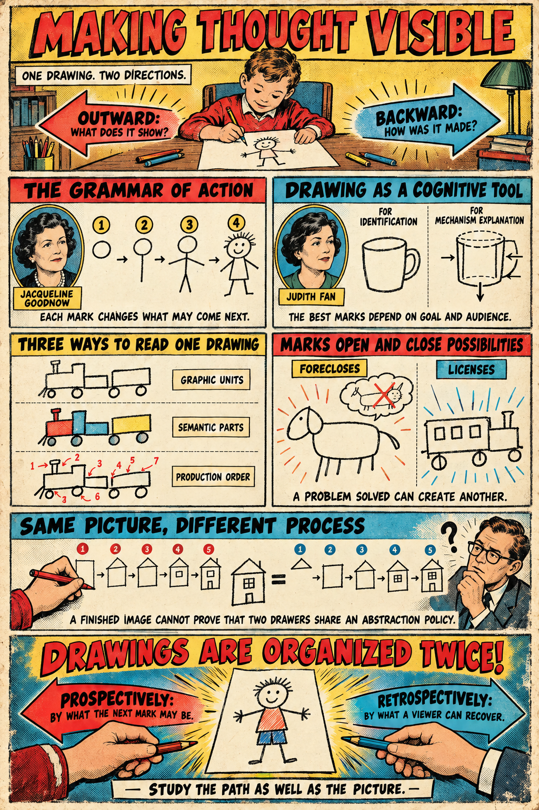

# Drawing and thought

[Making Thought Visible](https://standardgalactic.github.io/drawing/making_thought_visible.pdf)

Research and experiments on the order in which drawings are made, the development of graphic representation, and the use of drawing to think. The essays and figures here are separate works and should be read with their own citations and stated limits.

<!--
**Personal archive:** [Childhood drawings and older artwork](https://standardgalactic.github.io/archive). These are records of one person's drawing history, not a representative sample of children.
-->

**Interactive study:** [Drawing order](https://standardgalactic.github.io/drawing/) lets you reorder the same marks and share the sequence in a URL. It is a conceptual demonstration, not data from a developmental study.
